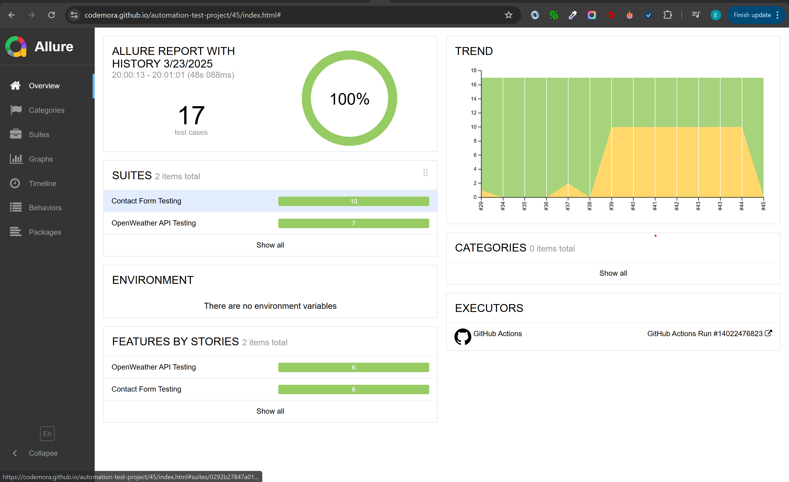

# Weather Test Automation Framework

## Setup Instructions
1. **Install Java 21**
2. **Install Maven**
3. **Clone the repository**
4. **Configure `config.properties`** (`src/test/resources/config.properties`):
  - Set `api.key` with your **OpenWeather API key**
  - Modify other settings as needed
5. **Install Maven dependencies**:
   ```sh
   mvn clean install -U
   ```  

---

## Running Tests Locally
### Run All Tests
- **Normal mode**:
  ```sh
  mvn test -Dheadless=false
  ```
- **Headless mode**:
  ```sh
  mvn test -Dheadless=true
  ```

### Run Specific Tests
- **API Tests**:
  ```sh
  mvn test -Dcucumber.filter.tags="@api"
  ```
- **Web Tests**:
  - **Normal mode**:
    ```sh
    mvn test -Dcucumber.filter.tags="@web" -Dheadless=false
    ```
  - **Headless mode**:
    ```sh
    mvn test -Dcucumber.filter.tags="@web" -Dheadless=true
    ```

### Allure Report
- **Generate report**:
  ```sh
  mvn allure:report
  ```
  - The generated report will be available at:
    ```
    target/site/allure-maven-plugin/index.html
    ```
- **Generate and Serve Report**:
  ```sh
  mvn allure:serve
  ```

---

## Configuration
- Located in: `src/test/resources/config.properties`
- Can be overridden via **system properties** (e.g., `-Dapi.key=your_key`)

### Available Properties:
| Property | Description |
|----------|------------|
| `api.base.url` | API endpoint |
| `api.key` | OpenWeather API key |
| `web.contact.url` | Contact form URL |
| `browser` | Default browser (chrome/firefox) |
| `headless` | Headless mode (true/false) |

---

## CI Integration (GitHub Actions)
- **Runs on push/pull requests to `main` branch**
- **Executes all tests**
- **Stores Allure results as artifacts**
- **Deploys report to GitHub Pages (on main branch pushes)**

### Setup for GitHub Actions
1. Enable **GitHub Pages** in repository settings (optional for report viewing)

### Viewing CI Results
- Check **GitHub Actions** tab for **pages build and deployment** job
- Download **Allure results** from artifacts
- View deployed report at:
  ```
  https://<username>.github.io/<repository>/<reportNumber>/index.html
  ```
### Viewing Test Logs
- Check **GitHub Actions** tab for test run status
- Download **Test Logs** from artifacts

---

## Framework Structure
📂 **`src/test/java/api`** – API Testing Components
- **`services/`** – API services (`WeatherService.java`)
- **`steps/`** – Step definitions
- **`utils/`** – API utility classes (`RestAssuredUtils.java`)

📂 **`src/test/java/web`** – Web UI Testing Components
- **`pages/`** – PageObjects
- **`steps/`** – Step definitions
- **`utils/`** – Web utilities (`DriverFactory.java`)

📂 **`src/test/resources/`**
- **`features/`** – Gherkin feature files
- **`config.properties`** – Configuration file

📂 **`src/test/java/utils`** – General utility classes (`ConfigUtils.java`)

📂 **`src/test/java/tests`** – Test runners

📂 **`.github/workflows/ci.yml`** – GitHub Actions CI configuration

---

## Features
✅ **BDD with Cucumber**  
✅ **REST API testing with REST Assured**  
✅ **Web UI testing with Selenium**  
✅ **Cross-browser testing (Chrome, Firefox)**  
✅ **Headless mode support**  
✅ **Network logging**  
✅ **Allure reporting**  
✅ **SLF4J logging**  
✅ **Automatic driver management (WebDriverManager)**  
✅ **CI/CD with GitHub Actions**  
✅ **Property-based configuration**  
✅ **Screenshot capture on UI test failure**  
✅ **API utility methods in APIUtils**

---

## Assumptions
- **OpenWeather API free tier is sufficient**
- **Selenium contact form is available**
- **Stable network conditions**
- **Internet connection available for WebDriverManager**

---

## Limitations
⚠ **Limited security test coverage**  
⚠ **Cross-browser reporting limitations with Allure Report**

---

## Test Results
- **API Tests** cover:
  - Functional
  - Boundary
  - Security
  - Integration

- **Web Tests** cover:
  - Form validation
  - Network monitoring

- **Reports generated in Allure format**, including:
  - **Screenshots on UI test failures**
  - **CI results accessible via GitHub Actions**
- #### Report Screenshot:

[View Report](https://codemora.github.io/automation-test-project/55/index.html)

---

